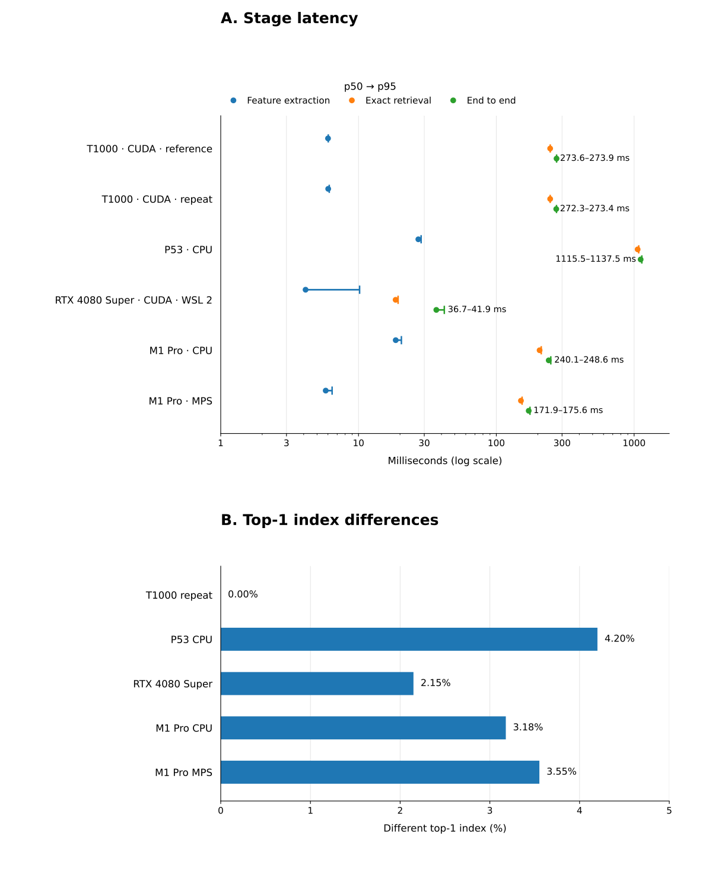

# Cross-platform evidence

The public record covers one frozen MVTec AD `bottle` workload under
`inspectrt_feature_memory_v1`. The scientific JSON and reviewed policy are
unchanged. The performance JSON contains six timing rows. All use benchmark
schema 2 and synchronized wall-clock timing from the same harness.

The matrix includes a Quadro T1000 on native Linux, an Intel Core i7-9850H CPU,
an RTX 4080 Super under WSL 2, and an M1 Pro using both CPU and MPS.

## Method

Each run used the accepted profile, ordered sample inventory, ResNet-50
`IMAGENET1K_V2` weights, and exact chunked top-1 squared-L2 retrieval against
the complete nominal bank. The scientific JSON comes from source commit
`bc330b9070c5ca8db9cb7cfbb27617256388536b`; its classifications and policy
values were not regenerated.

The six timing bundles use timing-harness commit
`4f230679d52b5ed08e43230ebb1308cb85a33e57` and `uv.lock` SHA-256
`4464c375e3bf0f9c575504b427a0e82aedc954ef3491807306b72c382ce07d5c`.
Each benchmark excluded five warm-ups and retained 30 measured repetitions.
`performance.json` contains every raw nanosecond observation. CPU intervals
measure synchronous host work without accelerator synchronization. CUDA and
MPS intervals synchronize the accelerator at their boundaries.

Stage measurements use a segmented complete-pipeline pass.
Feature extraction covers frozen `layer2` inference, local pooling, row-major
patch layout, and allocation. Exact retrieval covers the complete chunked
search, stable merge, result reshape, image maximum, and allocation. Both
stages include accelerator completion on CUDA and MPS.

A separate uninterrupted pass measures end to end. It starts before image
decode and ends after the raw anomaly map is materialized and the backend has
completed. Model load, nominal-bank construction and transfer, masks, metrics,
serialization, persistence, and console output are outside this interval. The
stage and end-to-end values come from separate passes, so they are not
additive. The p50 and p95 values below are recomputed from the persisted raw
arrays.

## Results



All values are milliseconds, shown as `p50 / p95` in evidence order.

| Environment | Feature extraction | Exact retrieval | End to end |
| --- | ---: | ---: | ---: |
| T1000 CUDA reference | `6.0076435 / 6.0330497` | `245.889269 / 246.27839245` | `273.639384 / 273.8713274` |
| T1000 CUDA repeat | `6.025451 / 6.1318254` | `245.9324995 / 246.04000495` | `272.258691 / 273.3827447` |
| Intel Core i7-9850H CPU | `27.1753105 / 28.462513099999998` | `1061.222402 / 1080.1501984` | `1115.5387955 / 1137.54055905` |
| RTX 4080 Super CUDA WSL 2 | `4.1291615 / 10.1818199` | `18.59127 / 19.375321` | `36.701378 / 41.93894815` |
| M1 Pro CPU | `18.622708 / 20.4750205` | `206.1779375 / 211.8529125` | `240.1169165 / 248.6138227` |
| M1 Pro MPS | `5.7808745 / 6.43175625` | `150.9159795 / 153.86682105` | `171.8568335 / 175.5521731` |

All 29 structural gates pass for every completed scientific candidate. Sample
IDs, labels, and masks match exactly. Every floating component has zero policy
violations, and each metric delta remains inside its reviewed limit. Exact
top-1 indices still differ across devices: 0 of 84,992 for the T1000 repeat,
3,569 for Intel Core i7-9850H CPU, 1,826 for RTX 4080 Super, 2,701 for M1 Pro
CPU, and 3,019 for M1 Pro MPS. The four cross-device records have status
`drift_detected` because exact index identity is a policy gate.

## Evidence

- [scientific.json](evidence/inspectrt_cross_platform_evidence_v2/scientific.json)
- [performance.json](evidence/inspectrt_cross_platform_evidence_v2/performance.json)
- [latency.svg](evidence/inspectrt_cross_platform_evidence_v2/latency.svg)
- [portability policy](../configs/portability_policy.json)

Regenerate the graph and check it against the tracked bytes with:

```bash
uv run python scripts/render_portability_latency.py \
  --scientific docs/evidence/inspectrt_cross_platform_evidence_v2/scientific.json \
  --performance docs/evidence/inspectrt_cross_platform_evidence_v2/performance.json \
  --check docs/evidence/inspectrt_cross_platform_evidence_v2/latency.svg
```

| Artifact | Identity |
| --- | --- |
| Comparison | `1dec773f2d237598305a315145bec7bc40b9f94fbd326ed44f6330d3c9a11fe5` |
| Policy | `inspectrt-bottle-bc330b9-v1` |
| Policy SHA-256 | `576717b70e53714eed8370619cc08c81517405728f767942298b0c8c415836a2` |
| `scientific.json` SHA-256 | `81318cd81c0e5f23be953719c2bb03604c22c75bb8c1dd17c389786623d32b8a` |
| Performance | `a6fe809b46bacafd6f1ffdbd3c22ad37d4da1226e48ed2cdd519148b99f3370e` |
| `performance.json` SHA-256 | `44057e5317b902341b1b359c0ff5a43f3900940115a206e1bd8ea2774adc85d9` |
| `latency.svg` SHA-256 | `0fabd72ac0c517c7a1d9f77f6a14a7f9cddee75039ffd8164555f004b61be57a` |

## Limits

Performance is descriptive, not inferential. Host power, host load, and thermal
conditions were not uniformly controlled. The record reports only absolute
observations and does not establish a cross-machine ordering or general
portability.

The records cover only the named profile, category, software versions, and
environments. Each timing row is one complete run and does not establish
behavior for other libraries, drivers, operating systems, or hardware. The
scientific comparison covers the nominal feature bank and persisted downstream
artifacts, but not raw test feature tensors.

`RT` means Runtime. Latency measurements do not imply a hard-real-time
guarantee.
